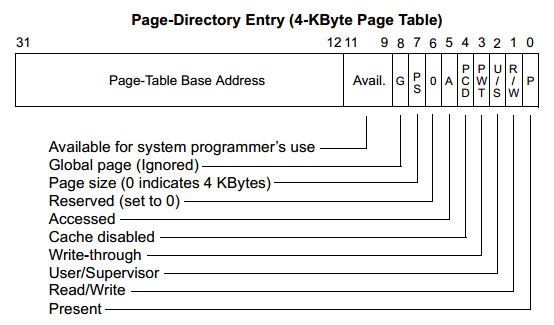
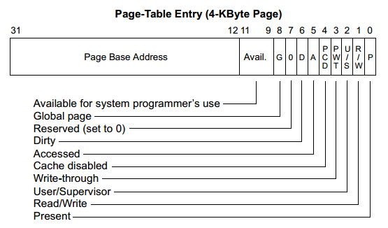

# Lab3 Report
# 李晨昊 2017011466
## 练习1：给未被映射的地址映射上物理页
### 1. 设计实现过程
代码如下
```c
int
do_pgfault(struct mm_struct *mm, uint32_t error_code, uintptr_t addr) {
...
    ptep = get_pte(mm->pgdir, addr, 1);              //(1) try to find a pte, if pte's PT(Page Table) isn't existed, then create a PT.
    if (*ptep == 0) { //(2) if the phy addr isn't exist, then alloc a page & map the phy addr with logical addr
        pgdir_alloc_page(mm->pgdir, addr, perm);
    }
...
}
```
逻辑如下：首先查询`addr`对应的页表项(不必担心它对应的页表不存在，因为`get_pte`的第三个参数`create`指定为1，页表不存在时会被创建)，如果它等于0，在ucore的逻辑中认为它是一个没有对应页帧的页表项，这里就给他分配一个页帧(不用担心内存不够的事情，由于pgdir_alloc_page内部已经处理了换入换出的逻辑，等到完成了练习2之后内存不够的情形自然会被处理)。

函数`pgdir_alloc_page`是`alloc_page`，`page_insert`，`swap_map_swappable`等的封装，`page_insert`里能通过addr找到`ptep`的地址并正确设置它的值(`*ptep = page2pa(page) | PTE_P | perm`)，因此这里不必再设置`*ptep`。

顺便记录一下我的分析：`check_pgfault`等函数之所以能引发缺页异常，是因为它访问的是0x100附近的虚拟地址，而建立页表的时候只处理了`KERNBASE ~ KERNBASE + KMEMSIZE`的虚拟内存的映射，因此`check_pgfault`所访问的内存没有被映射，可以引发缺页异常。至于`mm_struct`则只是一个纯软件的记录者，并不是因为它里面没有这一段虚拟地址才引发缺页异常的。

### 2. 请描述页目录项（Page Directory Entry）和页表项（Page Table Entry）中组成部分对ucore实现页替换算法的潜在用处。
在目前阶段页目录项和页表项中的信息都没有用于页替换算法(只是说选择策略，即`_fifo_map_swappable`和`_fifo_swap_out_victim`两个函数，没有说底层的处理机制)，所以这里分析的只是未来可能的用途。

页目录项和页表项的组成如下




分析如下：
- A：访问位。由硬件设置，用来指示此表项所指向的页是否已被访问（读或写）。这个位可以被ucore用来监视页的使用频率，例如优先换出A位为0的页。 
- D：脏位。由硬件设置，用来指示此表项所指向的页是否写过数据。这个位可以用来优化换出操作，例如没有写过数据的页在换出时不必进行磁盘IO，可以优先考虑换出它。

### 3. 如果ucore的缺页服务例程在执行过程中访问内存，出现了页访问异常，请问硬件要做哪些事情？
其实正常情况下(只要缺页服务例程老老实实地只访问内核划给自己的内存)不会发生这种事的...

我简单修改了一下进行测试
```c
static int
pgfault_handler(struct trapframe *tf) {
    extern struct mm_struct *check_mm_struct;
    *(char *)(100) = 1;
    print_pgfault(tf);
    if (check_mm_struct != NULL) {
        return do_pgfault(check_mm_struct, tf->tf_err, rcr2());
    }
    panic("unhandled page fault.\n");
}
```
然后也没有什么特别的事情发生，只是反复执行：访存 -> 缺页 -> ISR -> 访存 ... 而已

可见缺页服务例程中出现了页访问异常与其他的程序中出现了页访问异常没有什么区别，硬件都会
1. 将引发异常的线性地址放入cr2寄存器
2. 在栈中压入`cs eip efalgs err`(由于缺页服务例程在内核态，因此无需压入`ss esp`)
3. 转`__vectors[14]`执行

## 练习2：补充完成基于FIFO的页面替换算法
### 1. 设计实现过程
分为`swap_fifo.c`和`vmm.c`两个文件中的部分。

`swap_fifo.c`负责处理选择哪个页来换出的逻辑，需要实现两个函数
```c
/*
 * (3)_fifo_map_swappable: According FIFO PRA, we should link the most recent arrival page at the back of pra_list_head qeueue
 */
static int
_fifo_map_swappable(struct mm_struct *mm, uintptr_t addr, struct Page *page, int swap_in)
{
    list_entry_t *head=(list_entry_t*) mm->sm_priv;
    list_entry_t *entry=&(page->pra_page_link);
 
    assert(entry != NULL && head != NULL);
    //record the page access situlation
    /*LAB3 EXERCISE 2: 2017011466*/ 
    list_add_before(head, entry); //(1)link the most recent arrival page at the back of the pra_list_head qeueue.
    return 0;
}
```
`_fifo_map_swappable`是当内存中新产生了一个页时被调用，包括函数`pgdir_alloc_page`和`do_pgfault`，即要么是刚刚从内存申请到了一个页，要么是刚刚从硬盘换入了一个页。这就是FIFO的I过程。这里的逻辑很简单，只需要把`entry`加入由`head`表示的链表的队尾即可，由于`head`相当于哨兵节点，所以加到`head`之间即是加到了整个链表的队尾。
```c
/*
 *  (4)_fifo_swap_out_victim: According FIFO PRA, we should unlink the  earliest arrival page in front of pra_list_head qeueue,
 *                            then assign the value of *ptr_page to the addr of this page.
 */
static int
_fifo_swap_out_victim(struct mm_struct *mm, struct Page ** ptr_page, int in_tick)
{
     list_entry_t *head=(list_entry_t*) mm->sm_priv;
     assert(head != NULL);
     assert(in_tick==0);
     /* Select the victim */
     /*LAB3 EXERCISE 2: 2017011466*/ 
     struct Page *earliest = le2page(head->next, pra_page_link);
     list_del(&earliest->pra_page_link); //(1)  unlink the  earliest arrival page in front of pra_list_head qeueue
     *ptr_page = earliest; //(2)  assign the value of *ptr_page to the addr of this page
     return 0;
}
```
`_fifo_swap_out_victim`负责选择一个即将被换出的页，换出操作由函数`swap_out`来统一调度，具体换出由`swapfs_write`来执行。这就是FIFO的O过程。这里的逻辑也很简单，只需要把由`head`表示的链表的第一个节点(不是哨兵节点`head`)摘出来，把它对应的page赋给`ptr_page`即可。

### 2. 如果要在ucore上实现"extended clock页替换算法"请给你的设计方案，现有的swap_manager框架是否足以支持在ucore中实现此算法？如果是，请给你的设计方案。如果不是，请给出你的新的扩展和基此扩展的设计方案。并需要回答如下问题
可以，因为传给`map_swappable`和`swap_out_victim`的参数包括了`mm`和`addr`，用`mm->pgdir`和`addr`可以找到页表项的，页表项的中包含了extended clock页替换算法中所需要的访问位和修改位，只需要借助这些信息完成算法即可。

设计方案：`map_swappable`仍然负责把新的页加入页表，新加入的页就位于"时钟指针"处即可，这与extended clock页替换算法中换出一个页再把新页放在原页在链表中的位置的做法是一致的。`swap_out_victim`只需要依次查询页表项的的访问位和修改位，按照算法的逻辑执行即可。

#### 2.1. 需要被换出的页的特征是什么？
访问标记和修改标记都为0。

#### 2.2. 在ucore中如何判断具有这样特征的页？
查看页表项的访问位和修改位(由硬件设置)。

#### 2.3. 何时进行换入和换出操作？
仍然是被动地进行换入和换出：发生缺页异常时若页表项存在位为0而本身不为0则执行换入；任何时候如果`pmm_manager->alloc_pages`失败则执行换出。
